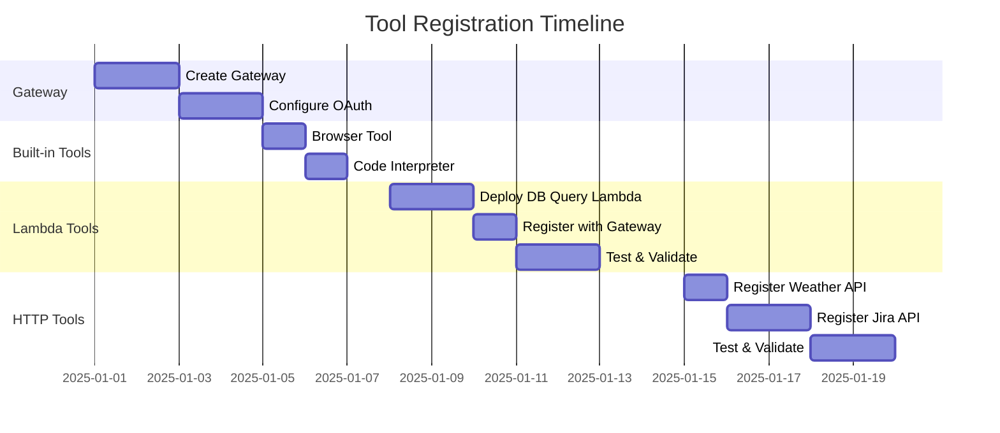

# AgentCore Gateway & Policy Integration Design Document

## Overview

This document outlines the design for integrating **Amazon Bedrock AgentCore Gateway** and **Policy** into our LangGraph agent deployment. AgentCore Gateway serves as a unified tool registry and access layer, while Policy provides fine-grained access control for agent tool calls.

**Reference**: [AWS Blog - AgentCore Policy & Evaluations](https://aws.amazon.com/blogs/aws/amazon-bedrock-agentcore-adds-quality-evaluations-and-policy-controls-for-deploying-trusted-ai-agents/)

---

## Executive Summary

AgentCore Gateway is the **centralized tool management layer** that:
1. **Registers and exposes tools** (Lambda, MCP servers, HTTP APIs, third-party services)
2. **Intercepts tool calls** for policy evaluation before execution
3. **Enforces authorization** via Cedar policies outside the agent's reasoning loop

### Key Benefits

| Benefit | Description |
|---------|-------------|
| **Centralized Tool Registry** | Single place to register, version, and manage all agent tools |
| **Multi-Protocol Support** | AWS Lambda, MCP servers, HTTP APIs, third-party services |
| **Security Boundary** | Policies enforced externally, not bypassable by agent reasoning |
| **Cedar Language** | Open-source, auditable policy language with formal verification |
| **Natural Language Authoring** | Non-technical teams can create policies |
| **Model Agnostic** | Works regardless of LLM or agent framework |

---

## Architecture

### Current Architecture

```
┌─────────────┐     ┌─────────────┐     ┌─────────────────────────┐
│  Streamlit  │────▶│     BFF     │────▶│   AgentCore Runtime     │
│   Frontend  │     │  (FastAPI)  │     │   (LangGraph Agent)     │
└─────────────┘     └─────────────┘     └─────────────────────────┘
                                                    │
                                                    ▼
                                        ┌─────────────────────────┐
                                        │   Tools (Direct Call)   │
                                        │ - Browser Tool          │
                                        │ - Code Interpreter      │
                                        └─────────────────────────┘
```

### Proposed Architecture with Gateway & Policy

```
┌─────────────┐     ┌─────────────┐     ┌─────────────────────────┐
│  Streamlit  │────▶│     BFF     │────▶│   AgentCore Runtime     │
│   Frontend  │     │  (FastAPI)  │     │   (LangGraph Agent)     │
└─────────────┘     └─────────────┘     └─────────────────────────┘
                          │                         │
                          │ (JWT Token)             │ Tool Calls
                          ▼                         ▼
┌─────────────────────────────────────────────────────────────────────────────┐
│                          AgentCore Gateway                                   │
│  ┌─────────────────────────────────────────────────────────────────────┐   │
│  │                         Tool Registry                                │   │
│  │  ┌───────────┐  ┌───────────┐  ┌───────────┐  ┌───────────────────┐ │   │
│  │  │  Browser  │  │   Code    │  │ Database  │  │   Slack/Jira/     │ │   │
│  │  │  (built)  │  │Interpreter│  │  Query    │  │   Custom Tools    │ │   │
│  │  └───────────┘  └───────────┘  └───────────┘  └───────────────────┘ │   │
│  └─────────────────────────────────────────────────────────────────────┘   │
│                                     │                                       │
│  ┌─────────────────────────────────────────────────────────────────────┐   │
│  │                         Policy Engine                                │   │
│  │  ┌─────────────┐  ┌─────────────┐  ┌─────────────┐                  │   │
│  │  │Role-Based   │  │ Domain      │  │ Rate Limit  │  ...             │   │
│  │  │Access (Cedar│  │ Restrict    │  │ Policies    │                  │   │
│  │  └─────────────┘  └─────────────┘  └─────────────┘                  │   │
│  └─────────────────────────────────────────────────────────────────────┘   │
└─────────────────────────────────────────────────────────────────────────────┘
                                        │
          ┌─────────────┬───────────────┼───────────────┬─────────────┐
          ▼             ▼               ▼               ▼             ▼
    ┌───────────┐ ┌───────────┐  ┌───────────┐  ┌───────────┐  ┌───────────┐
    │  Lambda   │ │    MCP    │  │   HTTP    │  │  Slack    │  │   Jira    │
    │ Functions │ │  Servers  │  │   APIs    │  │   API     │  │   API     │
    └───────────┘ └───────────┘  └───────────┘  └───────────┘  └───────────┘
```

---

## Adding Tools via AgentCore Gateway

AgentCore Gateway is the **centralized registry** for all tools your agent can access. Tools registered with Gateway:
- Are automatically available to agents connected to that Gateway
- Have their calls intercepted for policy evaluation
- Support multiple backend types (Lambda, MCP, HTTP)
- Include versioning and schema validation

### Tool Registration Overview

```
┌─────────────────────────────────────────────────────────────────────────────┐
│                         AgentCore Gateway                                    │
│  ┌─────────────────────────────────────────────────────────────────────┐   │
│  │                      Tool Registry                                   │   │
│  │  ┌─────────────┐  ┌─────────────┐  ┌─────────────┐  ┌───────────┐  │   │
│  │  │   Lambda    │  │     MCP     │  │    HTTP     │  │  Built-in │  │   │
│  │  │   Tools     │  │   Servers   │  │    APIs     │  │   Tools   │  │   │
│  │  └─────────────┘  └─────────────┘  └─────────────┘  └───────────┘  │   │
│  └─────────────────────────────────────────────────────────────────────┘   │
│                                    │                                        │
│                         Policy Evaluation                                   │
│                                    │                                        │
└────────────────────────────────────┼────────────────────────────────────────┘
                                     ▼
                              Tool Execution
```

### Tool Types Supported

| Type | Description | Use Case |
|------|-------------|----------|
| **AWS Lambda** | Serverless functions | Custom business logic, integrations |
| **MCP Server** | Model Context Protocol servers | Standardized tool interface |
| **HTTP API** | REST/GraphQL endpoints | Third-party services, internal APIs |
| **Built-in** | AgentCore managed tools | Browser, Code Interpreter |

---

## Tool Implementation Examples

### Example 1: Lambda-Based Database Query Tool

A custom tool that queries a database with policy-controlled access.

#### 1.1 Lambda Function

```python
# lambda/db_query_tool/handler.py
import json
import boto3
import psycopg2
from typing import Any

def handler(event: dict, context: Any) -> dict:
    """
    Database query tool - executes read-only SQL queries.
    
    Input Schema:
    {
        "query": "SELECT * FROM users WHERE id = $1",
        "params": [123],
        "database": "analytics"
    }
    """
    try:
        # Parse input from Gateway
        body = json.loads(event.get('body', '{}'))
        query = body.get('query', '')
        params = body.get('params', [])
        database = body.get('database', 'default')
        
        # Validate query is read-only (additional security layer)
        if not is_read_only_query(query):
            return {
                'statusCode': 403,
                'body': json.dumps({
                    'error': 'Only SELECT queries are permitted'
                })
            }
        
        # Get connection from secrets
        conn = get_db_connection(database)
        cursor = conn.cursor()
        
        cursor.execute(query, params)
        columns = [desc[0] for desc in cursor.description]
        rows = cursor.fetchall()
        
        # Format results
        results = [dict(zip(columns, row)) for row in rows]
        
        return {
            'statusCode': 200,
            'body': json.dumps({
                'success': True,
                'data': results,
                'row_count': len(results)
            })
        }
        
    except Exception as e:
        return {
            'statusCode': 500,
            'body': json.dumps({
                'error': str(e)
            })
        }

def is_read_only_query(query: str) -> bool:
    """Validate query is read-only."""
    query_upper = query.strip().upper()
    forbidden = ['INSERT', 'UPDATE', 'DELETE', 'DROP', 'CREATE', 'ALTER', 'TRUNCATE']
    return not any(word in query_upper for word in forbidden)

def get_db_connection(database: str):
    """Get database connection from Secrets Manager."""
    secrets = boto3.client('secretsmanager')
    secret = secrets.get_secret_value(SecretId=f'db/{database}/credentials')
    creds = json.loads(secret['SecretString'])
    
    return psycopg2.connect(
        host=creds['host'],
        port=creds['port'],
        database=creds['database'],
        user=creds['username'],
        password=creds['password']
    )
```

#### 1.2 Register Tool with Gateway

```python
# infrastructure/register_db_tool.py
import boto3

def register_db_query_tool(gateway_arn: str, lambda_arn: str):
    """Register database query tool with AgentCore Gateway."""
    
    client = boto3.client('bedrock-agentcore', region_name='us-west-2')
    
    response = client.create_gateway_tool(
        gatewayArn=gateway_arn,
        name='query_database',
        description='''Query databases using SQL. Returns structured data.
        
Use this tool when you need to:
- Look up user information
- Get analytics data
- Search records by criteria

Available databases: analytics, users, products''',
        
        toolType='LAMBDA',
        lambdaConfiguration={
            'functionArn': lambda_arn,
            'invocationType': 'REQUEST_RESPONSE'
        },
        
        inputSchema={
            'type': 'object',
            'properties': {
                'query': {
                    'type': 'string',
                    'description': 'SQL SELECT query to execute'
                },
                'params': {
                    'type': 'array',
                    'items': {'type': 'string'},
                    'description': 'Query parameters for prepared statement'
                },
                'database': {
                    'type': 'string',
                    'enum': ['analytics', 'users', 'products'],
                    'description': 'Target database'
                }
            },
            'required': ['query', 'database']
        },
        
        outputSchema={
            'type': 'object',
            'properties': {
                'success': {'type': 'boolean'},
                'data': {
                    'type': 'array',
                    'items': {'type': 'object'}
                },
                'row_count': {'type': 'integer'},
                'error': {'type': 'string'}
            }
        },
        
        # Tool metadata for versioning
        version='1.0.0',
        tags={
            'team': 'data-platform',
            'category': 'database'
        }
    )
    
    return response['toolArn']
```

#### 1.3 Cedar Policy for Database Tool

```cedar
// db_query_policy.cedar
// Fine-grained database access control

// Data analysts can query analytics database
permit(
  principal is AgentCore::OAuthUser,
  action == AgentCore::Action::"query_database",
  resource == AgentCore::Gateway::"${GATEWAY_ARN}"
)
when {
  principal.getTag("role") == "analyst" &&
  context.input.database == "analytics"
};

// Admins can query any database
permit(
  principal is AgentCore::OAuthUser,
  action == AgentCore::Action::"query_database",
  resource == AgentCore::Gateway::"${GATEWAY_ARN}"
)
when {
  principal.getTag("role") == "admin"
};

// Block queries with dangerous patterns
forbid(
  principal,
  action == AgentCore::Action::"query_database",
  resource == AgentCore::Gateway::"${GATEWAY_ARN}"
)
when {
  context.input.query like "*DROP*" ||
  context.input.query like "*DELETE*" ||
  context.input.query like "*TRUNCATE*" ||
  context.input.query like "*--*"  // SQL injection attempt
};

// Limit result size for non-admins
forbid(
  principal is AgentCore::OAuthUser,
  action == AgentCore::Action::"query_database",
  resource == AgentCore::Gateway::"${GATEWAY_ARN}"
)
when {
  principal.getTag("role") != "admin" &&
  !(context.input.query like "*LIMIT*")
};
```

---

### Example 2: MCP Server Tool (Slack Integration)

Register an external MCP server as a Gateway tool.

#### 2.1 MCP Server Implementation

```python
# mcp_servers/slack_server.py
from mcp.server import Server
from mcp.types import Tool, TextContent
import httpx

app = Server("slack-mcp-server")

@app.tool()
async def send_slack_message(
    channel: str,
    message: str,
    thread_ts: str = None
) -> str:
    """
    Send a message to a Slack channel.
    
    Args:
        channel: Slack channel ID or name (e.g., #general, C01234567)
        message: Message text to send (supports Slack markdown)
        thread_ts: Optional thread timestamp to reply in thread
    
    Returns:
        Message timestamp and channel info
    """
    async with httpx.AsyncClient() as client:
        response = await client.post(
            "https://slack.com/api/chat.postMessage",
            headers={"Authorization": f"Bearer {SLACK_BOT_TOKEN}"},
            json={
                "channel": channel,
                "text": message,
                "thread_ts": thread_ts
            }
        )
        
        data = response.json()
        if data.get("ok"):
            return f"✅ Message sent to {channel} (ts: {data['ts']})"
        else:
            return f"❌ Failed: {data.get('error')}"

@app.tool()
async def search_slack_messages(
    query: str,
    channel: str = None,
    count: int = 10
) -> str:
    """
    Search Slack messages.
    
    Args:
        query: Search query string
        channel: Optional channel to search in
        count: Number of results (max 100)
    """
    params = {"query": query, "count": min(count, 100)}
    if channel:
        params["query"] += f" in:{channel}"
    
    async with httpx.AsyncClient() as client:
        response = await client.get(
            "https://slack.com/api/search.messages",
            headers={"Authorization": f"Bearer {SLACK_USER_TOKEN}"},
            params=params
        )
        
        data = response.json()
        if not data.get("ok"):
            return f"❌ Search failed: {data.get('error')}"
        
        messages = data.get("messages", {}).get("matches", [])
        results = []
        for msg in messages[:count]:
            results.append(f"• [{msg['channel']['name']}] {msg['username']}: {msg['text'][:100]}")
        
        return "\n".join(results) if results else "No messages found"

if __name__ == "__main__":
    app.run()
```

#### 2.2 Register MCP Server with Gateway

```python
# infrastructure/register_slack_tool.py
import boto3

def register_slack_mcp_tools(gateway_arn: str, mcp_endpoint: str):
    """Register Slack MCP server tools with AgentCore Gateway."""
    
    client = boto3.client('bedrock-agentcore', region_name='us-west-2')
    
    # Register send_slack_message tool
    client.create_gateway_tool(
        gatewayArn=gateway_arn,
        name='send_slack_message',
        description='Send a message to a Slack channel. Use for notifications, alerts, or team communication.',
        
        toolType='MCP',
        mcpConfiguration={
            'serverEndpoint': mcp_endpoint,
            'toolName': 'send_slack_message',
            'authentication': {
                'type': 'SECRETS_MANAGER',
                'secretArn': 'arn:aws:secretsmanager:us-west-2:313117444016:secret:slack/bot-token'
            }
        },
        
        inputSchema={
            'type': 'object',
            'properties': {
                'channel': {
                    'type': 'string',
                    'description': 'Slack channel ID or name'
                },
                'message': {
                    'type': 'string',
                    'description': 'Message text (supports Slack markdown)'
                },
                'thread_ts': {
                    'type': 'string',
                    'description': 'Optional thread timestamp for replies'
                }
            },
            'required': ['channel', 'message']
        }
    )
    
    # Register search_slack_messages tool
    client.create_gateway_tool(
        gatewayArn=gateway_arn,
        name='search_slack_messages',
        description='Search Slack messages across channels. Use to find past conversations or information.',
        
        toolType='MCP',
        mcpConfiguration={
            'serverEndpoint': mcp_endpoint,
            'toolName': 'search_slack_messages'
        },
        
        inputSchema={
            'type': 'object',
            'properties': {
                'query': {
                    'type': 'string',
                    'description': 'Search query'
                },
                'channel': {
                    'type': 'string',
                    'description': 'Optional channel to limit search'
                },
                'count': {
                    'type': 'integer',
                    'minimum': 1,
                    'maximum': 100,
                    'default': 10
                }
            },
            'required': ['query']
        }
    )
```

#### 2.3 Cedar Policy for Slack Tools

```cedar
// slack_policy.cedar
// Control Slack tool access

// Only allow sending to approved channels
permit(
  principal is AgentCore::OAuthUser,
  action == AgentCore::Action::"send_slack_message",
  resource == AgentCore::Gateway::"${GATEWAY_ARN}"
)
when {
  context.input.channel in [
    "#general",
    "#engineering",
    "#alerts",
    "#agent-notifications"
  ]
};

// Block @here and @channel mentions for non-admins
forbid(
  principal is AgentCore::OAuthUser,
  action == AgentCore::Action::"send_slack_message",
  resource == AgentCore::Gateway::"${GATEWAY_ARN}"
)
when {
  principal.getTag("role") != "admin" &&
  (context.input.message like "*@here*" ||
   context.input.message like "*@channel*" ||
   context.input.message like "*@everyone*")
};

// Search is allowed for all authenticated users
permit(
  principal is AgentCore::OAuthUser,
  action == AgentCore::Action::"search_slack_messages",
  resource == AgentCore::Gateway::"${GATEWAY_ARN}"
);
```

---

### Example 3: HTTP API Tool (External Service)

Register a third-party API as a Gateway tool.

#### 3.1 Register HTTP Tool

```python
# infrastructure/register_http_tool.py
import boto3

def register_weather_api_tool(gateway_arn: str):
    """Register weather API as a Gateway tool."""
    
    client = boto3.client('bedrock-agentcore', region_name='us-west-2')
    
    response = client.create_gateway_tool(
        gatewayArn=gateway_arn,
        name='get_weather',
        description='Get current weather and forecast for a location. Returns temperature, conditions, and forecast.',
        
        toolType='HTTP',
        httpConfiguration={
            'endpoint': 'https://api.openweathermap.org/data/2.5/weather',
            'method': 'GET',
            'headers': {
                'Accept': 'application/json'
            },
            'queryParameterMapping': {
                'q': '${input.location}',
                'units': '${input.units}',
                'appid': '${secret:openweathermap/api-key}'  # From Secrets Manager
            },
            'authentication': {
                'type': 'API_KEY',
                'secretArn': 'arn:aws:secretsmanager:us-west-2:313117444016:secret:openweathermap/api-key'
            },
            # Transform response
            'responseMapping': {
                'temperature': '$.main.temp',
                'description': '$.weather[0].description',
                'humidity': '$.main.humidity',
                'location': '$.name'
            }
        },
        
        inputSchema={
            'type': 'object',
            'properties': {
                'location': {
                    'type': 'string',
                    'description': 'City name (e.g., "Seattle, WA" or "London, UK")'
                },
                'units': {
                    'type': 'string',
                    'enum': ['metric', 'imperial'],
                    'default': 'metric',
                    'description': 'Temperature units'
                }
            },
            'required': ['location']
        }
    )
    
    return response['toolArn']
```

#### 3.2 Register Jira Integration

```python
# infrastructure/register_jira_tool.py
import boto3

def register_jira_tools(gateway_arn: str):
    """Register Jira API tools with Gateway."""
    
    client = boto3.client('bedrock-agentcore', region_name='us-west-2')
    
    # Create Jira Issue
    client.create_gateway_tool(
        gatewayArn=gateway_arn,
        name='create_jira_issue',
        description='Create a new Jira issue. Use for bug reports, feature requests, or task tracking.',
        
        toolType='HTTP',
        httpConfiguration={
            'endpoint': 'https://your-domain.atlassian.net/rest/api/3/issue',
            'method': 'POST',
            'headers': {
                'Content-Type': 'application/json',
                'Accept': 'application/json'
            },
            'authentication': {
                'type': 'BASIC',
                'secretArn': 'arn:aws:secretsmanager:us-west-2:313117444016:secret:jira/credentials'
            },
            'bodyTemplate': '''{
                "fields": {
                    "project": {"key": "${input.project}"},
                    "summary": "${input.summary}",
                    "description": {
                        "type": "doc",
                        "version": 1,
                        "content": [{"type": "paragraph", "content": [{"type": "text", "text": "${input.description}"}]}]
                    },
                    "issuetype": {"name": "${input.issue_type}"},
                    "priority": {"name": "${input.priority}"},
                    "labels": ${input.labels}
                }
            }'''
        },
        
        inputSchema={
            'type': 'object',
            'properties': {
                'project': {
                    'type': 'string',
                    'description': 'Jira project key (e.g., PROJ, ENG)'
                },
                'summary': {
                    'type': 'string',
                    'description': 'Issue title/summary'
                },
                'description': {
                    'type': 'string',
                    'description': 'Detailed issue description'
                },
                'issue_type': {
                    'type': 'string',
                    'enum': ['Bug', 'Task', 'Story', 'Epic'],
                    'default': 'Task'
                },
                'priority': {
                    'type': 'string',
                    'enum': ['Highest', 'High', 'Medium', 'Low', 'Lowest'],
                    'default': 'Medium'
                },
                'labels': {
                    'type': 'array',
                    'items': {'type': 'string'},
                    'default': []
                }
            },
            'required': ['project', 'summary', 'description']
        }
    )
    
    # Search Jira Issues
    client.create_gateway_tool(
        gatewayArn=gateway_arn,
        name='search_jira_issues',
        description='Search for Jira issues using JQL. Returns matching issues with key, summary, status.',
        
        toolType='HTTP',
        httpConfiguration={
            'endpoint': 'https://your-domain.atlassian.net/rest/api/3/search',
            'method': 'POST',
            'headers': {
                'Content-Type': 'application/json'
            },
            'authentication': {
                'type': 'BASIC',
                'secretArn': 'arn:aws:secretsmanager:us-west-2:313117444016:secret:jira/credentials'
            },
            'bodyTemplate': '''{
                "jql": "${input.jql}",
                "maxResults": ${input.max_results},
                "fields": ["key", "summary", "status", "assignee", "priority"]
            }''',
            'responseMapping': {
                'issues': '$.issues[*].{key: key, summary: fields.summary, status: fields.status.name}'
            }
        },
        
        inputSchema={
            'type': 'object',
            'properties': {
                'jql': {
                    'type': 'string',
                    'description': 'JQL query (e.g., "project = PROJ AND status = Open")'
                },
                'max_results': {
                    'type': 'integer',
                    'minimum': 1,
                    'maximum': 50,
                    'default': 10
                }
            },
            'required': ['jql']
        }
    )
```

#### 3.3 Cedar Policy for Jira Tools

```cedar
// jira_policy.cedar

// Engineers can create bugs and tasks in their projects
permit(
  principal is AgentCore::OAuthUser,
  action == AgentCore::Action::"create_jira_issue",
  resource == AgentCore::Gateway::"${GATEWAY_ARN}"
)
when {
  principal.getTag("role") in ["engineer", "admin"] &&
  context.input.issue_type in ["Bug", "Task"]
};

// Only PMs can create Epics and Stories
permit(
  principal is AgentCore::OAuthUser,
  action == AgentCore::Action::"create_jira_issue",
  resource == AgentCore::Gateway::"${GATEWAY_ARN}"
)
when {
  principal.getTag("role") in ["pm", "admin"] &&
  context.input.issue_type in ["Epic", "Story"]
};

// Block highest priority unless admin
forbid(
  principal is AgentCore::OAuthUser,
  action == AgentCore::Action::"create_jira_issue",
  resource == AgentCore::Gateway::"${GATEWAY_ARN}"
)
when {
  principal.getTag("role") != "admin" &&
  context.input.priority == "Highest"
};

// Everyone can search
permit(
  principal is AgentCore::OAuthUser,
  action == AgentCore::Action::"search_jira_issues",
  resource == AgentCore::Gateway::"${GATEWAY_ARN}"
);
```

---

## Gateway Tool Management

### List All Registered Tools

```python
# scripts/list_gateway_tools.py
import boto3

def list_gateway_tools(gateway_arn: str):
    """List all tools registered with a Gateway."""
    
    client = boto3.client('bedrock-agentcore', region_name='us-west-2')
    
    paginator = client.get_paginator('list_gateway_tools')
    
    tools = []
    for page in paginator.paginate(gatewayArn=gateway_arn):
        tools.extend(page['tools'])
    
    print(f"Gateway: {gateway_arn}")
    print(f"Total tools: {len(tools)}\n")
    
    for tool in tools:
        print(f"  📦 {tool['name']} (v{tool.get('version', '1.0.0')})")
        print(f"     Type: {tool['toolType']}")
        print(f"     ARN: {tool['toolArn']}")
        print(f"     Description: {tool['description'][:60]}...")
        print()
    
    return tools
```

### Update Tool Version

```python
# scripts/update_tool.py
import boto3

def update_gateway_tool(
    tool_arn: str,
    description: str = None,
    input_schema: dict = None,
    lambda_arn: str = None
):
    """Update an existing Gateway tool."""
    
    client = boto3.client('bedrock-agentcore', region_name='us-west-2')
    
    update_params = {'toolArn': tool_arn}
    
    if description:
        update_params['description'] = description
    if input_schema:
        update_params['inputSchema'] = input_schema
    if lambda_arn:
        update_params['lambdaConfiguration'] = {'functionArn': lambda_arn}
    
    response = client.update_gateway_tool(**update_params)
    
    print(f"✅ Updated tool: {tool_arn}")
    print(f"   New version: {response.get('version')}")
    
    return response
```

### Delete Tool

```python
# scripts/delete_tool.py
import boto3

def delete_gateway_tool(tool_arn: str):
    """Remove a tool from Gateway."""
    
    client = boto3.client('bedrock-agentcore', region_name='us-west-2')
    
    # First disable the tool (soft delete)
    client.update_gateway_tool(
        toolArn=tool_arn,
        status='DISABLED'
    )
    
    # Then delete
    client.delete_gateway_tool(toolArn=tool_arn)
    
    print(f"🗑️ Deleted tool: {tool_arn}")
```

---

## Tool Integration with LangGraph Agent

### Update Agent to Use Gateway Tools

```python
# bedrock/agent_runtime.py
from langchain_core.tools import StructuredTool
from bedrock_agentcore.gateway import GatewayToolClient

def create_agent_with_gateway_tools(gateway_arn: str):
    """Create LangGraph agent with tools from Gateway."""
    
    # Initialize Gateway client
    gateway = GatewayToolClient(gateway_arn=gateway_arn)
    
    # Fetch all available tools from Gateway
    gateway_tools = gateway.list_tools()
    
    # Convert to LangChain tools
    langchain_tools = []
    for tool_def in gateway_tools:
        langchain_tools.append(
            StructuredTool.from_function(
                func=lambda **kwargs, t=tool_def: gateway.invoke_tool(t['name'], kwargs),
                name=tool_def['name'],
                description=tool_def['description'],
                args_schema=tool_def['inputSchema']
            )
        )
    
    # Add built-in AgentCore tools
    browser_tool = get_browser_tool()
    code_tool = get_code_interpreter_tool()
    
    if browser_tool:
        langchain_tools.append(browser_tool)
    if code_tool:
        langchain_tools.append(code_tool)
    
    # Create agent with all tools
    llm = ChatBedrock(model_id="anthropic.claude-sonnet-4-20250514-v1:0")
    llm_with_tools = llm.bind_tools(langchain_tools)
    
    # ... rest of agent creation
```

---

## Policy Engine Design

### 1. Policy Engine Configuration

```yaml
# policy-engine-config.yaml
policy_engine:
  name: "langgraph-agent-policy-engine"
  description: "Policy engine for LangGraph agent tool access control"
  
  associated_gateways:
    - arn:aws:bedrock-agentcore:us-west-2:313117444016:gateway/langgraph-gateway
  
  enforcement_mode: "enforce"  # Options: "enforce" | "log-only"
  
  logging:
    enabled: true
    cloudwatch_log_group: "/aws/bedrock-agentcore/policy/langgraph-agent"
```

### 2. Cedar Policy Definitions

#### Policy 1: Browser Tool Access Control

```cedar
// browser_access_policy.cedar
// Restrict browser tool to authenticated users with specific roles

permit(
  principal is AgentCore::OAuthUser,
  action == AgentCore::Action::"browse_web",
  resource == AgentCore::Gateway::"${GATEWAY_ARN}"
)
when {
  principal.hasTag("role") &&
  principal.getTag("role") in ["admin", "researcher", "analyst"]
};

// Deny access to sensitive domains
forbid(
  principal,
  action == AgentCore::Action::"browse_web",
  resource == AgentCore::Gateway::"${GATEWAY_ARN}"
)
when {
  context.input.url like "*internal.company.com*" ||
  context.input.url like "*admin.*" ||
  context.input.url like "*.gov/*"
};
```

#### Policy 2: Code Interpreter Restrictions

```cedar
// code_interpreter_policy.cedar
// Control code execution capabilities

permit(
  principal is AgentCore::OAuthUser,
  action == AgentCore::Action::"execute_code",
  resource == AgentCore::Gateway::"${GATEWAY_ARN}"
)
when {
  principal.hasTag("tier") &&
  principal.getTag("tier") in ["premium", "enterprise"]
};

// Rate limiting: max code length
forbid(
  principal,
  action == AgentCore::Action::"execute_code",
  resource == AgentCore::Gateway::"${GATEWAY_ARN}"
)
when {
  context.input.code.size() > 10000  // Max 10KB code
};
```

#### Policy 3: Session-Based Access

```cedar
// session_policy.cedar
// Ensure session isolation

permit(
  principal is AgentCore::OAuthUser,
  action,
  resource == AgentCore::Gateway::"${GATEWAY_ARN}"
)
when {
  principal.hasTag("session_id") &&
  context.session_id == principal.getTag("session_id")
};
```

---

## Implementation Plan

### Phase 1: Gateway Setup (Week 1)

#### 1.1 Create AgentCore Gateway

```python
# infrastructure/gateway_setup.py
import boto3

def create_agentcore_gateway():
    client = boto3.client('bedrock-agentcore', region_name='us-west-2')
    
    response = client.create_gateway(
        name='langgraph-agent-gateway',
        description='Gateway for LangGraph agent with policy enforcement',
        authenticationConfiguration={
            'type': 'OAUTH',
            'oauthConfig': {
                'issuer': 'https://cognito-idp.us-west-2.amazonaws.com/${USER_POOL_ID}',
                'audience': ['${APP_CLIENT_ID}']
            }
        },
        tools=[
            {
                'name': 'browse_web',
                'description': 'Browse websites and extract information',
                'inputSchema': {
                    'type': 'object',
                    'properties': {
                        'url': {'type': 'string'},
                        'task': {'type': 'string'}
                    },
                    'required': ['url', 'task']
                }
            },
            {
                'name': 'execute_code',
                'description': 'Execute Python code in sandbox',
                'inputSchema': {
                    'type': 'object',
                    'properties': {
                        'code': {'type': 'string'}
                    },
                    'required': ['code']
                }
            }
        ]
    )
    
    return response['gatewayArn']
```

#### 1.2 Register Tools with Gateway

```python
# bedrock/gateway_tools.py
from bedrock_agentcore.gateway import GatewayClient

def register_tools_with_gateway(gateway_arn: str):
    """Register agent tools with AgentCore Gateway for policy enforcement."""
    
    client = GatewayClient(gateway_arn=gateway_arn)
    
    # Register browser tool
    client.register_tool(
        name="browse_web",
        handler=browse_web_handler,
        schema={
            "type": "object",
            "properties": {
                "url": {"type": "string", "description": "URL to browse"},
                "task": {"type": "string", "description": "Task to perform"}
            }
        }
    )
    
    # Register code interpreter
    client.register_tool(
        name="execute_code",
        handler=execute_code_handler,
        schema={
            "type": "object",
            "properties": {
                "code": {"type": "string", "description": "Python code to execute"}
            }
        }
    )
    
    return client
```

### Phase 2: Policy Engine Creation (Week 2)

#### 2.1 Create Policy Engine

```python
# infrastructure/policy_engine.py
import boto3

def create_policy_engine(gateway_arn: str):
    client = boto3.client('bedrock-agentcore', region_name='us-west-2')
    
    response = client.create_policy_engine(
        name='langgraph-policy-engine',
        description='Policy engine for LangGraph agent',
        associatedGateways=[gateway_arn],
        enforcementMode='ENFORCE',  # or 'LOG_ONLY' for testing
        loggingConfiguration={
            'cloudWatchLogGroupArn': 'arn:aws:logs:us-west-2:313117444016:log-group:/aws/bedrock-agentcore/policy'
        }
    )
    
    return response['policyEngineArn']
```

#### 2.2 Add Policies

```python
# infrastructure/policies.py
import boto3

def add_policy(policy_engine_arn: str, policy_name: str, cedar_policy: str):
    client = boto3.client('bedrock-agentcore', region_name='us-west-2')
    
    response = client.create_policy(
        policyEngineArn=policy_engine_arn,
        name=policy_name,
        policyType='CEDAR',
        policyDocument=cedar_policy
    )
    
    return response['policyArn']


# Example: Add browser access policy
BROWSER_POLICY = """
permit(
  principal is AgentCore::OAuthUser,
  action == AgentCore::Action::"browse_web",
  resource == AgentCore::Gateway::"arn:aws:bedrock-agentcore:us-west-2:313117444016:gateway/langgraph-gateway"
)
when {
  principal.hasTag("role") &&
  principal.getTag("role") in ["admin", "researcher"]
};
"""

add_policy(
    policy_engine_arn="arn:aws:bedrock-agentcore:us-west-2:313117444016:policy-engine/langgraph-policy",
    policy_name="browser-access-policy",
    cedar_policy=BROWSER_POLICY
)
```

### Phase 3: BFF Integration (Week 3)

#### 3.1 JWT Token Propagation

```python
# bff/app/services/agent_client.py

from fastapi import Request, HTTPException
from fastapi.security import HTTPBearer, HTTPAuthorizationCredentials

security = HTTPBearer()

class AgentClient:
    async def invoke_agent_with_policy(
        self,
        message: str,
        session_id: str,
        credentials: HTTPAuthorizationCredentials
    ):
        """Invoke agent through Gateway with JWT for policy evaluation."""
        
        # Extract JWT token for policy evaluation
        jwt_token = credentials.credentials
        
        async with self.session.client(
            "bedrock-agent-runtime",
            region_name=self.region
        ) as client:
            response = await client.invoke_agent_runtime(
                agentRuntimeArn=self.runtime_arn,
                gatewayArn=self.gateway_arn,  # NEW: Route through gateway
                authorizationToken=jwt_token,  # NEW: Pass JWT for policy
                inputPayload=json.dumps({
                    "query": message,
                    "session_id": session_id
                }),
                stream=True
            )
            
            return response
```

#### 3.2 Update API Endpoints

```python
# bff/app/main.py

from fastapi import Depends
from fastapi.security import HTTPBearer, HTTPAuthorizationCredentials

security = HTTPBearer(auto_error=False)

@app.post("/v1/chat/stream")
async def chat_stream(
    request: ChatRequest,
    credentials: HTTPAuthorizationCredentials = Depends(security)
):
    """Stream chat responses with policy-enforced tool access."""
    
    async def event_generator():
        try:
            async for event in agent_client.stream_agent_response_with_policy(
                message=request.message,
                session_id=request.session_id,
                credentials=credentials
            ):
                yield event
        except PolicyDeniedException as e:
            yield f"event: error\ndata: {json.dumps({'error': 'access_denied', 'message': str(e)})}\n\n"
    
    return StreamingResponse(
        event_generator(),
        media_type="text/event-stream"
    )
```

### Phase 4: Frontend Auth Integration (Week 4)

#### 4.1 Add Cognito Authentication

```python
# streamlit-ui/auth.py

import streamlit as st
from streamlit_cognito_auth import CognitoAuthenticator

def setup_auth():
    """Configure Cognito authentication for policy enforcement."""
    
    authenticator = CognitoAuthenticator(
        pool_id=st.secrets["cognito"]["pool_id"],
        app_client_id=st.secrets["cognito"]["app_client_id"],
        app_client_secret=st.secrets["cognito"]["app_client_secret"]
    )
    
    is_logged_in = authenticator.login()
    
    if not is_logged_in:
        st.stop()
    
    return authenticator.get_credentials()
```

#### 4.2 Pass JWT to BFF

```python
# streamlit-ui/app.py

def stream_response_with_auth(bff_url: str, prompt: str, session_id: str, jwt_token: str):
    """Stream response with JWT token for policy enforcement."""
    
    headers = {
        "Content-Type": "application/json",
        "Authorization": f"Bearer {jwt_token}"  # Pass JWT for policy evaluation
    }
    
    with httpx.stream(
        "POST",
        f"{bff_url}/v1/chat/stream",
        json={"message": prompt, "session_id": session_id},
        headers=headers,
        timeout=120.0
    ) as response:
        # ... existing streaming logic
```

---

## Policy Use Cases

### Use Case 1: Role-Based Tool Access

| Role | Browser Tool | Code Interpreter | Max Code Size |
|------|--------------|------------------|---------------|
| `guest` | ❌ | ❌ | - |
| `user` | ✅ (public URLs only) | ❌ | - |
| `researcher` | ✅ | ✅ | 5KB |
| `admin` | ✅ | ✅ | Unlimited |

### Use Case 2: Domain Restrictions

```cedar
// Deny access to competitor websites
forbid(
  principal,
  action == AgentCore::Action::"browse_web",
  resource
)
when {
  context.input.url like "*competitor1.com*" ||
  context.input.url like "*competitor2.com*"
};
```

### Use Case 3: Cost Control

```cedar
// Limit code execution for free tier users
forbid(
  principal is AgentCore::OAuthUser,
  action == AgentCore::Action::"execute_code",
  resource
)
when {
  principal.getTag("tier") == "free" &&
  principal.getTag("daily_executions") > 10
};
```

### Use Case 4: Compliance & Audit

```cedar
// Require explicit consent for data processing
permit(
  principal is AgentCore::OAuthUser,
  action == AgentCore::Action::"execute_code",
  resource
)
when {
  principal.hasTag("gdpr_consent") &&
  principal.getTag("gdpr_consent") == "true"
};
```

---

## IAM Permissions

### Gateway & Tool Management Permissions

```json
{
  "Version": "2012-10-17",
  "Statement": [
    {
      "Sid": "GatewayManagement",
      "Effect": "Allow",
      "Action": [
        "bedrock-agentcore:CreateGateway",
        "bedrock-agentcore:UpdateGateway",
        "bedrock-agentcore:DeleteGateway",
        "bedrock-agentcore:GetGateway",
        "bedrock-agentcore:ListGateways",
        "bedrock-agentcore:AssociatePolicyEngine"
      ],
      "Resource": "arn:aws:bedrock-agentcore:us-west-2:313117444016:gateway/*"
    },
    {
      "Sid": "GatewayToolManagement",
      "Effect": "Allow",
      "Action": [
        "bedrock-agentcore:CreateGatewayTool",
        "bedrock-agentcore:UpdateGatewayTool",
        "bedrock-agentcore:DeleteGatewayTool",
        "bedrock-agentcore:GetGatewayTool",
        "bedrock-agentcore:ListGatewayTools",
        "bedrock-agentcore:InvokeGatewayTool"
      ],
      "Resource": [
        "arn:aws:bedrock-agentcore:us-west-2:313117444016:gateway/*",
        "arn:aws:bedrock-agentcore:us-west-2:313117444016:gateway/*/tool/*"
      ]
    },
    {
      "Sid": "LambdaToolInvocation",
      "Effect": "Allow",
      "Action": [
        "lambda:InvokeFunction"
      ],
      "Resource": "arn:aws:lambda:us-west-2:313117444016:function:agentcore-*"
    },
    {
      "Sid": "SecretsForTools",
      "Effect": "Allow",
      "Action": [
        "secretsmanager:GetSecretValue"
      ],
      "Resource": [
        "arn:aws:secretsmanager:us-west-2:313117444016:secret:slack/*",
        "arn:aws:secretsmanager:us-west-2:313117444016:secret:jira/*",
        "arn:aws:secretsmanager:us-west-2:313117444016:secret:db/*",
        "arn:aws:secretsmanager:us-west-2:313117444016:secret:openweathermap/*"
      ]
    },
    {
      "Sid": "PolicyEngineManagement",
      "Effect": "Allow",
      "Action": [
        "bedrock-agentcore:CreatePolicyEngine",
        "bedrock-agentcore:UpdatePolicyEngine",
        "bedrock-agentcore:DeletePolicyEngine",
        "bedrock-agentcore:GetPolicyEngine",
        "bedrock-agentcore:ListPolicyEngines"
      ],
      "Resource": "arn:aws:bedrock-agentcore:us-west-2:313117444016:policy-engine/*"
    },
    {
      "Sid": "PolicyManagement",
      "Effect": "Allow",
      "Action": [
        "bedrock-agentcore:CreatePolicy",
        "bedrock-agentcore:UpdatePolicy",
        "bedrock-agentcore:DeletePolicy",
        "bedrock-agentcore:GetPolicy",
        "bedrock-agentcore:ListPolicies"
      ],
      "Resource": "arn:aws:bedrock-agentcore:us-west-2:313117444016:policy/*"
    }
  ]
}
```

### Lambda Tool Execution Role

For Lambda-based tools, the function needs its own execution role:

```json
{
  "Version": "2012-10-17",
  "Statement": [
    {
      "Sid": "DatabaseAccess",
      "Effect": "Allow",
      "Action": [
        "secretsmanager:GetSecretValue"
      ],
      "Resource": "arn:aws:secretsmanager:us-west-2:313117444016:secret:db/*"
    },
    {
      "Sid": "CloudWatchLogs",
      "Effect": "Allow",
      "Action": [
        "logs:CreateLogGroup",
        "logs:CreateLogStream",
        "logs:PutLogEvents"
      ],
      "Resource": "arn:aws:logs:us-west-2:313117444016:log-group:/aws/lambda/agentcore-*"
    },
    {
      "Sid": "VPCAccess",
      "Effect": "Allow",
      "Action": [
        "ec2:CreateNetworkInterface",
        "ec2:DescribeNetworkInterfaces",
        "ec2:DeleteNetworkInterface"
      ],
      "Resource": "*",
      "Condition": {
        "StringEquals": {
          "ec2:Vpc": "arn:aws:ec2:us-west-2:313117444016:vpc/vpc-xxx"
        }
      }
    }
  ]
}
```

---

## Observability & Monitoring

### CloudWatch Metrics

| Metric | Description |
|--------|-------------|
| `PolicyEvaluations` | Total policy evaluations |
| `PolicyPermits` | Permitted actions |
| `PolicyDenials` | Denied actions |
| `PolicyEvaluationLatency` | Time to evaluate policies |

### CloudWatch Alarms

```python
# infrastructure/alarms.py
import boto3

def create_policy_alarms():
    cloudwatch = boto3.client('cloudwatch', region_name='us-west-2')
    
    # Alert on high denial rate
    cloudwatch.put_metric_alarm(
        AlarmName='HighPolicyDenialRate',
        MetricName='PolicyDenials',
        Namespace='AWS/BedrockAgentCore',
        Statistic='Sum',
        Period=300,
        EvaluationPeriods=2,
        Threshold=100,
        ComparisonOperator='GreaterThanThreshold',
        AlarmActions=['arn:aws:sns:us-west-2:313117444016:alerts']
    )
```

### Sample Log Query

```sql
-- CloudWatch Logs Insights query for policy denials
fields @timestamp, @message
| filter @message like /DENY/
| parse @message "principal=* action=* resource=* decision=*" as principal, action, resource, decision
| stats count(*) as denials by action
| sort denials desc
| limit 20
```

---

## Testing Strategy

### 1. Log-Only Mode Testing

Start with `enforcementMode: LOG_ONLY` to validate policies without blocking:

```python
# Test policy evaluation without enforcement
def test_policy_log_only():
    response = invoke_tool_call(
        tool="execute_code",
        input={"code": "print('test')"},
        user_role="guest"  # Should be denied
    )
    
    # Tool call succeeds in log-only mode
    assert response.status == "success"
    
    # But logs show denial
    logs = get_policy_logs()
    assert any(log["decision"] == "DENY" for log in logs)
```

### 2. Unit Tests for Cedar Policies

```python
# tests/test_policies.py
import cedar_policy

def test_browser_policy_permits_researcher():
    policy = load_policy("browser_access_policy.cedar")
    
    request = cedar_policy.Request(
        principal={"type": "OAuthUser", "tags": {"role": "researcher"}},
        action="browse_web",
        resource="gateway-arn",
        context={"input": {"url": "https://example.com"}}
    )
    
    result = policy.evaluate(request)
    assert result.decision == "PERMIT"

def test_browser_policy_denies_guest():
    policy = load_policy("browser_access_policy.cedar")
    
    request = cedar_policy.Request(
        principal={"type": "OAuthUser", "tags": {"role": "guest"}},
        action="browse_web",
        resource="gateway-arn",
        context={"input": {"url": "https://example.com"}}
    )
    
    result = policy.evaluate(request)
    assert result.decision == "DENY"
```

---

## Rollout Plan

| Phase | Duration | Activities | Success Criteria |
|-------|----------|------------|------------------|
| **Phase 1** | Week 1 | Gateway setup, register built-in tools | Gateway created, Browser & Code Interpreter working |
| **Phase 2** | Week 2 | Add custom Lambda tools (Database Query) | Lambda tools invoking successfully |
| **Phase 3** | Week 3 | Add HTTP API tools (Weather, Jira) | External APIs responding through Gateway |
| **Phase 4** | Week 4 | Policy engine, initial policies (log-only) | Policies logging correctly |
| **Phase 5** | Week 5 | BFF JWT integration | JWT tokens propagating |
| **Phase 6** | Week 6 | Add MCP server tools (Slack) | MCP tools working end-to-end |
| **Phase 7** | Week 7 | Frontend auth, enforce mode | Full policy enforcement |
| **Phase 8** | Week 8 | Monitoring, alarms, documentation | Production ready |

### Detailed Phase Breakdown

#### Phase 1-3: Tool Registration (Weeks 1-3)



#### Phase 4-5: Policy Implementation (Weeks 4-5)

| Policy | Tools Affected | Mode |
|--------|---------------|------|
| Role-based access | All | Log-only → Enforce |
| Domain restrictions | Browser | Log-only → Enforce |
| Code size limits | Code Interpreter | Enforce |
| Database access | DB Query | Enforce |
| Jira project restrictions | Jira | Log-only → Enforce |

---

## Risks & Mitigations

| Risk | Impact | Mitigation |
|------|--------|------------|
| Policy misconfiguration blocks legitimate users | High | Start with log-only mode; comprehensive testing |
| JWT token expiration during long sessions | Medium | Implement token refresh in frontend |
| Increased latency from policy evaluation | Low | AgentCore Gateway designed for real-time evaluation |
| Complex Cedar syntax errors | Medium | Use natural language policy authoring |

---

## Tool Registry Summary

### All Tools to Register

| Tool Name | Type | Backend | Policy Required | Priority |
|-----------|------|---------|-----------------|----------|
| `browse_web` | Built-in | AgentCore Browser | Role-based, Domain restrictions | P0 |
| `execute_code` | Built-in | AgentCore Code Interpreter | Role-based, Size limits | P0 |
| `query_database` | Lambda | PostgreSQL/RDS | Role-based, Database-specific, Query validation | P1 |
| `get_weather` | HTTP | OpenWeatherMap API | Rate limiting | P2 |
| `create_jira_issue` | HTTP | Jira Cloud API | Role-based, Project restrictions | P1 |
| `search_jira_issues` | HTTP | Jira Cloud API | All authenticated users | P1 |
| `send_slack_message` | MCP | Slack MCP Server | Channel restrictions, Mention blocking | P1 |
| `search_slack_messages` | MCP | Slack MCP Server | All authenticated users | P2 |

### Tool Schema Template

```json
{
  "name": "tool_name",
  "description": "Clear description of what the tool does and when to use it",
  "toolType": "LAMBDA | MCP | HTTP",
  "inputSchema": {
    "type": "object",
    "properties": {
      "param1": {
        "type": "string",
        "description": "Parameter description"
      }
    },
    "required": ["param1"]
  },
  "outputSchema": {
    "type": "object",
    "properties": {
      "result": {"type": "string"}
    }
  },
  "version": "1.0.0",
  "tags": {
    "team": "platform",
    "category": "integration"
  }
}
```

---

## References

- [AWS Blog: AgentCore Policy & Evaluations](https://aws.amazon.com/blogs/aws/amazon-bedrock-agentcore-adds-quality-evaluations-and-policy-controls-for-deploying-trusted-ai-agents/)
- [Cedar Policy Language](https://www.cedarpolicy.com/)
- [AgentCore Developer Guide](https://docs.aws.amazon.com/bedrock/latest/userguide/agents-agentcore.html)
- [AgentCore Gateway Documentation](https://docs.aws.amazon.com/bedrock/latest/userguide/agents-agentcore-gateway.html)
- [Model Context Protocol (MCP)](https://modelcontextprotocol.io/)

---

## Appendix: Natural Language to Cedar

AgentCore Policy supports **natural language policy authoring**. Examples:

| Natural Language | Generated Cedar |
|-----------------|-----------------|
| "Only admins can execute code" | `permit(...) when { principal.getTag("role") == "admin" };` |
| "Block access to .gov websites" | `forbid(...) when { context.input.url like "*.gov*" };` |
| "Limit code to 5000 characters for free users" | `forbid(...) when { principal.getTag("tier") == "free" && context.input.code.size() > 5000 };` |

The natural language feature is also available as an **MCP server** for AI-assisted coding environments.

